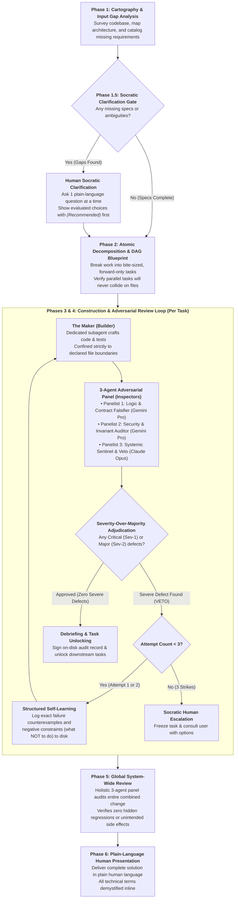

# The DAG Orchestration Engine (`dag`): A Layman's Guide

---

## 1. Executive Summary

When most people interact with an Artificial Intelligence (AI) model like ChatGPT or Claude, they treat it like a single conversational partner: you ask a question or give an instruction, and the AI answers in one continuous train of thought. While this conversational approach works remarkably well for drafting emails, brainstorming ideas, or writing short scripts, it breaks down dramatically when applied to serious, multi-step engineering projects. A single AI attempting to build a complex system quickly suffers from memory overload, makes up answers to fill in missing details, praises its own mistakes, and accidentally damages parts of the project it was never supposed to touch.

The **DAG Orchestration Engine** (referred to simply as the **`dag` skill**) completely replaces this informal, single-agent conversation with an enterprise-grade, distributed engineering methodology. 

Instead of treating the AI as an isolated programmer writing code in a vacuum, the `dag` skill transforms the AI into an **entire engineering department**:
* **It maps before building**: It thoroughly surveys your existing files and rules before touching a single line of code.
* **It clarifies instead of guessing**: If a requirement is missing or unclear, it stops and asks you clear, single questions in plain language rather than guessing.
* **It breaks work into an unbendable roadmap**: It divides large goals into small, bite-sized tasks arranged in a strict one-way sequence called a **Directed Acyclic Graph** (a flowchart of tasks that always moves forward and never loops backward into endless confusion).
* **It enforces total separation of powers**: The AI agent that builds a feature is strictly forbidden from reviewing its own work.
* **It deploys a panel of rival AI inspectors**: Every single piece of work is independently audited by a panel of three skeptical AI reviewers from different AI model families (such as Google Gemini and Anthropic Claude).
* **It values safety over democracy**: A single severe security bug or broken rule immediately vetoes the work, even if the other reviewers voted to approve it.
* **It learns systematically from failure**: If an inspector rejects a piece of work, the builder is given exact counterexamples and negative rules (what *not* to do) and allowed up to three bounded attempts to get it right.
* **It writes every receipt to disk**: Every contract, review verdict, failure lesson, and test result is permanently saved in transparent files on your computer.

In short, the `dag` skill replaces blind AI optimism with disciplined, adversarial engineering rigor, guaranteeing that complex software projects are delivered accurately, safely, and without unintended side effects.

---

## 2. The Problem with Traditional AI: Why Chatbots Fail at Real Engineering

To appreciate what the `dag` skill does, it helps to understand why standard LLM (Large Language Model) interactions fail when faced with complex technical tasks:

### 1. The "All-in-One" Memory Trap (Context Fog)
A traditional AI has a working memory window. When you ask a single AI to plan an architecture, write code across dozens of files, debug errors, and verify results all in one long chat session, its memory becomes cluttered with thousands of words of past chatter. In technical terms, the model loses focus: it forgets earlier constraints, mixes up file names, and produces code that subtly contradicts its original instructions.

### 2. Self-Review Blindness (The "Looks Good to Me" Flaw)
When a human or an AI reviews their own work, they suffer from confirmation bias. If you ask an AI model, *"Here is the code you just wrote; is it secure and complete?"*, it will almost always reply, *"Yes, this looks great!"* The same internal biases and blind spots that caused the AI to make a mistake in the first place prevent it from spotting that mistake during self-review.

### 3. The Plausibility Trap (Polite Guessing)
AI models are trained to be helpful and continuous. When faced with missing information (such as how long a login session should last or how errors should be handled), standard AI models rarely pause to ask for clarification. Instead, they pick the most statistically common guess from their training data. This creates phantom designs and dangerous assumptions that quietly break production environments.

### 4. Shared Blind Spots (Cognitive Monoculture)
If you use only one AI model family (for example, only one company's AI) to both write code and check code, both passes share the exact same training quirks, tokenizer habits, and safety filters. A subtle security flaw that slips through a model during creation will easily slip through the exact same model during inspection.

### 5. Accidental Collateral Damage (Scope Creep and File Clobbering)
When given broad permission to edit a project, standard AI assistants often rewrite unrelated files, delete existing comments, change public interfaces that other programs rely on, or attempt to do three unrelated things at once, corrupting the project.

---

## 3. What the `dag` Skill Accomplishes

The `dag` skill solves every single failure mode described above. When you invoke the `dag` skill, it achieves the following concrete outcomes:

1. **Guaranteed Zero Guesswork**: It prevents the AI from making unverified assumptions. Missing information is either proven using authoritative documentation or brought to you in a single, simple question.
2. **Defect Elimination Through Adversarial Scrutiny**: Every piece of code is subjected to intense, hostile scrutiny by three specialized reviewer agents before it can ever be merged.
3. **Multi-Model Diversity**: It uses different AI models developed by rival organizations to inspect each other's work, ensuring that one model's blind spot is caught by another model's strength.
4. **Strict Containment**: It creates an explicit boundary around every task. The AI is permitted to touch *only* the specific files it declared in advance. If it touches anything else, the work is instantly rejected.
5. **Full Auditability**: It leaves behind a complete, readable paper trail on your computer. You can open any folder and see exactly what contract was assigned, how the reviewers voted, what bugs were caught, and how those bugs were corrected.
6. **No Runaway Loops**: If an AI cannot solve a specific problem within three attempts, it stops immediately and presents the dilemma to you with clear options, preventing wasted time and runaway costs.

---

## 4. How It Works: The Step-by-Step Lifecycle

The `dag` skill follows a strict six-phase lifecycle designed to mimic the best practices of high-stakes aerospace and enterprise engineering.

Here is how each phase works in plain language:

### Phase 1: Mapping the Territory (Cartography & Input Gap Analysis)
Before anyone picks up a hammer, a surveyor must map the land. In this phase, the AI performs **Cartography** (a comprehensive survey of your existing files, code structures, interfaces, and rules).

At the same time, it conducts an **Input Gap Analysis** (a methodical search for missing requirements). If your request says *"Build a secure login system,"* the surveyor checks whether you specified how long passwords must be, how expired tokens are revoked, or how database errors are handled. Rather than guessing these details, the surveyor catalogs every gap.

### Phase 1.5: The Clarification Gate (Asking Before Building)
This is one of the most critical safety checkpoints in the entire skill. Before any code is planned or written, the engine enters a mandatory **Clarification Gate**. 

If any missing requirements or ambiguities were uncovered during mapping, the engine is **strictly forbidden from proceeding autonomously**. It must pause and consult you. 

To make this completely painless for you, it adheres to four golden communication rules:
* **Strictly one question at a time**: It will never overwhelm you with a massive laundry list of questions.
* **Plain human language**: Every technical term is explained immediately inline within parentheses or commas.
* **Thorough evaluation of choices**: It presents at least two clear options, detailing the pros, cons, and trade-offs of each.
* **The best choice is presented first**: The safest and most maintainable option is placed at the top and marked `(Recommended)`.

Once you make your choice, that decision is recorded permanently on disk, and the engine moves to the next phase.

### Phase 2: Building the Blueprint (The Directed Acyclic Graph)
Once all requirements are crystal clear, the engine designs the master blueprint. It breaks down the overall goal into small, self-contained units of work called **Atomic Work Units** (small tasks with a single, clear responsibility).

It arranges these tasks into a **DAG** (a Directed Acyclic Graph). In everyday terms, think of a DAG as a recipe or a construction schedule where:
* **Directed** means steps flow in a specific forward direction (you must pour the foundation before you can frame the walls).
* **Acyclic** means there are no circular loops (you can never get trapped in a loop where Task A is waiting for Task B, which is waiting for Task A).
* **Graph** simply means a map of tasks connected by dependency arrows.

The engine also mathematically verifies that any tasks scheduled to run in parallel will not attempt to read or write the same files at the same time, preventing accidental collisions.

### Phase 3 & 4: The Construction & Inspection Loop (Maker vs. Checker)
Every single task in the blueprint is executed through a disciplined loop. This is where the core philosophy of **"Maker != Checker"** (the person who makes something cannot be the person who inspects it) comes to life.

For each individual task:

#### 1. The Briefing Contract
The orchestrator writes a formal document called a **Briefing** (`briefing.md`) to your disk. This document specifies:
* The exact goal of the task.
* The required inputs and expected outputs.
* The declared **Write-Set** (a strict list of only the files this task is authorized to touch).
* Any lessons or negative constraints learned from prior mistakes.

#### 2. The Specialized Builder (The Maker)
A dedicated AI subagent is launched with a fresh, clean memory budget. Its only job is to follow the briefing contract, write the code, and author unit tests. It is completely unaware of the broader chatter from earlier phases, allowing it to focus 100% of its reasoning power on this single task.

Before the work can even be submitted to the reviewers, an automated gate checks the file system: **did the builder touch any file outside its declared write list?** If it did, the work is instantly vetoed for a boundary violation.

#### 3. The Three-Judge Adversarial Panel (The Checkers)
Once the builder finishes, three separate, independent AI inspector subagents are launched in parallel. These inspectors are instructed to be skeptical, rigorous, and demanding. They are given read-only access—they cannot edit code; their only job is to find flaws.

Crucially, these three inspectors use **heterogeneous AI models** (different model families from different AI companies) to ensure diverse perspectives:

* **Panelist 1: Correctness & Contract Falsifier** (Powered by Google Gemini Pro Deep Think):
  This inspector acts like a relentless logic tester. It actively searches for extreme boundary cases (such as what happens if an input is zero, empty, negative, or millions of characters long) and tests whether the code strictly satisfies the promised contract.
* **Panelist 2: Security & Boundary Auditor** (Powered by Google Gemini Pro Deep Think):
  This inspector acts like an ethical hacker. It audits the code for security holes, data leaks, memory waste, and timing vulnerabilities.
* **Panelist 3: Systemic Blast Radius Sentinel** (Powered by Anthropic Claude Opus):
  This inspector acts like a chief systems architect. Because it runs on an entirely different AI architecture from Claude, it brings an independent set of eyes to the code written by Gemini. It checks whether the new code will accidentally break other existing programs in your project, whether it alters public interfaces, and whether it introduces unnecessary complexity.

#### 4. The Golden Adjudication Rule: Severity Over Majority
In standard politics or committee voting, a 2-to-1 majority wins. In the `dag` engine, **democratic voting is completely rejected as dangerous**.

Think of a commercial airplane: if two inspectors say the seats are comfortable and the paint looks great, but one inspector points out that the left wing has a cracked bolt, you do not board the plane because of a "2-to-1 majority vote." The severity of the crack overrules the majority.

The `dag` engine enforces this exact principle, called **Severity Over Majority**:
* **Sev-1 (Critical Defect)**: Catastrophic security flaw or data-corruption hazard.
* **Sev-2 (Major Defect)**: Functional failure, broken existing contract, or missing test.
* **Sev-3 (Minor Defect)**: Small stylistic preference or comment typo.

If **ANY single reviewer** discovers an uncorrected Sev-1 or Sev-2 flaw, the deliverable is **immediately REJECTED and VETOED**, even if the other two reviewers voted to approve it!

#### 5. The Bounded Learning Loop (Learning from Mistakes)
When an inspection fails, the engine does not give up or ask the builder to "try again" blindly. Instead:
1. It automatically extracts the exact failure counterexample (e.g., *"When given the input `../../../etc/passwd`, the code allowed directory traversal"*).
2. It formulates a concrete **Negative Constraint** (e.g., *"DO NOT concatenate raw user input into file paths"*).
3. It appends this lesson into a permanent file on disk called `learnings.jsonl`.
4. It updates the builder's briefing with these new rules and commands the builder to fix the issue.

To prevent infinite loops and runaway costs, the builder is allowed a maximum of **three iterations**. If it fails three times, execution freezes safely, and the issue is escalated to you in a plain-language Socratic inquiry.

#### 6. Debriefing & Unlocking
Only when all three reviewers approve the work (with zero Sev-1 or Sev-2 defects) is the task signed off. A formal **Debriefing** document is written to disk, and the next tasks on the roadmap are unlocked.

### Phase 5: The Global System-Wide Inspection
After every single task in the blueprint is completed, the engine convenes one final, holistic review panel. 

The panel inspects the **entire combined change** across the whole project. This ensures that even though each individual part passed its own test, the combination of all parts working together does not create hidden performance bottlenecks, memory leaks, or architectural drift.

### Phase 6: Plain-Language Human Presentation
Finally, the engine summarizes the completed project for you. 

In accordance with its communication standards, it speaks in clear, accessible human language, explaining what was built, what problems were discovered and resolved during adversarial review, and providing you with a clean, fully verified result.

---

## 5. Key Architectural Principles & Why They Are Strictly Necessary

Every feature of the `dag` skill exists for a proven, hard-won engineering reason. Here is why the system is built the way it is:

| Architectural Mechanism | What It Does in Plain English | Why It Is Strictly Necessary |
| :--- | :--- | :--- |
| **Cartography First** | Maps files, schemas, and rules before touching any code. | You cannot safely renovate a building without knowing where the load-bearing walls and electrical wires are. Skipping this leads to broken systems. |
| **Phase 1.5 Clarification Gate** | Pauses to ask you about missing specs one question at a time before planning begins. | Prevents the AI from guessing. An unverified assumption caught upfront costs zero; an assumption discovered after 500 lines of code are written requires tearing everything down. |
| **Directed Acyclic Graph (DAG)** | Organizes tasks into a strict, forward-only dependency roadmap. | Prevents circular dependencies, deadlock, and chaotic task hopping. Guarantees that foundation work is completed before dependent features begin. |
| **Maker != Checker Orthogonality** | Prohibits the builder from reviewing or approving its own work. | Human psychology and AI behavior prove that creators cannot objectively spot their own subtle mistakes. Independent inspection is essential for truth. |
| **Tri-Model Heterogeneous Review** | Uses different AI model families (Google Gemini and Anthropic Claude) on the same code. | Eliminates "cognitive monoculture." If one model family has a training blind spot, a rival model family from another company will readily catch it. |
| **Severity Over Majority** | A single critical flaw vetos the work, regardless of how many reviewers voted "Approve." | Software safety is not a democracy. One fatal security hole or data loss bug ruins the entire application, no matter how good the rest of the code is. |
| **Declared Write-Sets (Frame Conditions)** | Forces each task to list exactly which files it is allowed to modify. | Prevents accidental collateral damage. Stops an AI working on the login screen from silently breaking the billing system. |
| **Bounded Self-Learning ($N \le 3$)** | Feeds exact failure lessons back into the prompt, capped at 3 tries. | Keeps retries focused and prevents "hallucination spirals" where an AI gets confused and makes code progressively worse with each retry. |
| **On-Disk Auditability (`.omp_wip`)** | Saves all briefings, verdicts, logs, and debriefings to permanent files on your drive. | Guarantees complete transparency. If an agent crashes, gets interrupted, or runs out of memory, all progress and historical decisions remain intact. |
| **Single-Question Socratic Inquiries** | Asks only one question at a time, explaining technical terms and putting the recommended choice first. | Respects your time and mental clarity. Prevents cognitive overload while ensuring you remain in full control of all architectural decisions. |

---

## 6. Side-by-Side Comparison: Traditional LLM vs. The `dag` Skill

| Dimension | Traditional LLM Chat | The `dag` Skill Engine |
| :--- | :--- | :--- |
| **Organizational Model** | A single person talking out loud in an endless conversation. | A coordinated engineering department with a Project Director, Builders, and specialized Review Panels. |
| **Missing Information** | Guesses what you probably meant based on typical internet tutorials. | Pauses and asks you a clear, single question with trade-offs and a recommended choice. |
| **Task Execution** | Tries to do everything in one massive, tangled response. | Decomposes goals into a verified, step-by-step roadmap (DAG) executed in isolated stages. |
| **Quality Verification** | Asks itself *"Does this look right?"* and answers *"Yes!"* | Three skeptical, independent reviewers vigorously attack the code with edge cases and security audits. |
| **Model Diversity** | Single model family reviewing its own output (shared blind spots). | Heterogeneous models from different companies (Gemini + Claude) auditing each other. |
| **Handling of Disagreements** | No mechanism; takes the first plausible answer. | **Severity Over Majority**: A single critical flaw halts progress until resolved. |
| **Handling Mistakes** | Apologizes, repeats the apology, and often repeats the same mistake. | Logs exact failure counterexamples and negative constraints to disk, briefing the next iteration with what *not* to do. |
| **Scope Control** | May edit any file in your project unexpectedly. | Strictly confined to declared file boundaries; unauthorized edits trigger an instant veto. |
| **Persistence & Audit** | Lost in the scrolling chat window; gone if context is cleared. | Saved permanently in structured, human-readable folders on your hard drive. |
| **Communication Style** | Dense, unverified technical jargon or sycophantic chatter. | Clear, plain human language with all technical terms explained inline. |

---

## 7. Conclusion: The Future of Trustworthy Autonomous Engineering

The `dag` skill represents a fundamental paradigm shift in how artificial intelligence is applied to software engineering. 

It recognizes a vital truth: **intelligence without process is unreliable**. No matter how powerful an individual AI model becomes, asking a single model to design, construct, verify, and deliver a complex engineering system in one continuous conversation is inherently prone to memory lapses, blind spots, and unverified assumptions.

By surrounding the AI with proven engineering principles—thorough cartography, upfront clarification, modular decomposition, separation of builder and inspector roles, cross-model adversarial scrutiny, and strict safety vetoes—the `dag` skill replaces guesswork with verifiable truth. 

For the human user, the result is peace of mind: you interact with a calm, courteous director who asks for your guidance only when meaningful decisions arise, while behind the scenes, an entire panel of tireless, skeptical experts ensures that every line of code delivered to your machine is robust, secure, and built to last.
