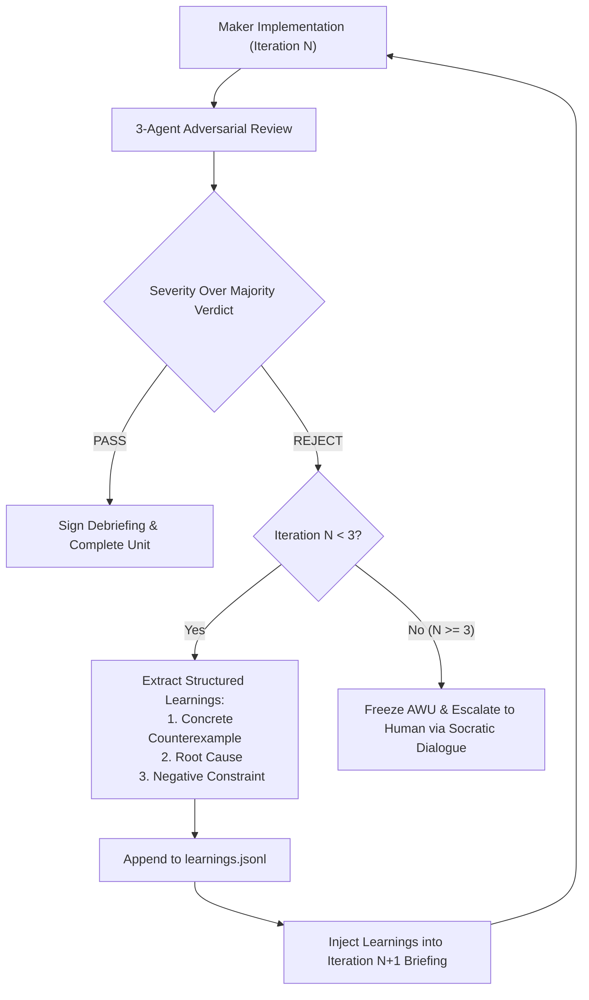

# Bounded Verification & Self-Learning Loops

## 1. Principle of Bounded Verification

Unbounded iterative loops lead to token exhaustion, hallucinations, and code deterioration. The `dag` skill enforces **Bounded Verification**:
- Every Atomic Work Unit (AWU) has a hard upper limit of **3 execution iterations** ($N_{max} = 3$).
- Each failure must yield structured learnings and negative constraints that prevent repeating the error.

---

## 2. The Self-Learning Cycle



---

## 3. Structured Learning Format (`learnings.jsonl`)

Whenever an adversarial panel issues a REJECT or VETO, the automated engine (`adjudicate_panel.py` / `adjudicate_panel.sh`) parses the panel's findings and appends structured JSON records directly to `.omp_wip/<session>/units/<AWU-ID>/learnings.jsonl`:

```json
{
  "awu_id": "AWU-001",
  "iteration": 1,
  "timestamp": "2026-09-20T01:25:30Z",
  "panelist_source": "Panelist 2: Security & Invariants Auditor",
  "severity": "Sev-1",
  "defect_summary": "Unsanitized file path permits directory traversal.",
  "counterexample": "Input string: '../../../etc/passwd' resolves outside the sandbox root.",
  "root_cause": "Maker used naive string concatenation rather than path.resolve() with a root boundary check.",
  "negative_constraint": "DO NOT concatenate user input directly into file path strings. MUST enforce that path.resolve() starts with the authorized sandbox prefix."
}
```

Every AWU is guaranteed to have `learnings.jsonl` created during initial unit scaffolding via `scaffold_dag_unit.py` / `scaffold_dag_unit.sh`.

---

## 4. Re-Briefing with Negative Constraints

For iteration $N+1$, `adjudicate_panel` formats the accumulated negative constraints directly onto the console and into the session records. The orchestrator injects these into the updated `briefing.md`:

```markdown
### MANDATORY ACCUMULATED CONSTRAINTS (From Prior Iterations)
The previous implementation was VETOED due to critical flaws. You are strictly bound by the following negative constraints:
1. [From Iteration 1 - Sev-1]: Under no circumstances use direct string concatenation for file paths.
2. [From Iteration 1 - Sev-1]: You MUST include an explicit assertion verifying that resolved paths remain within the sandbox prefix.
```

---

## 5. Escalation on Bound Breach ($N > 3$)

If an AWU fails three consecutive iterations:
1. **Halt Execution**: Stop spawning further Maker or Checker agents for this unit.
2. **Diagnostic State Freeze**: Preserve all diffs, panel transcripts, and test outputs in the unit directory.
3. **Trigger Critical Human Escalation**:
   - Synthesize a clear, Socratic briefing for the human user.
   - Use plain language with all technical terms explained inline.
   - Present a detailed internal analysis of why the bound was breached.
   - Present options, with the optimal path marked `(Recommended)`.
