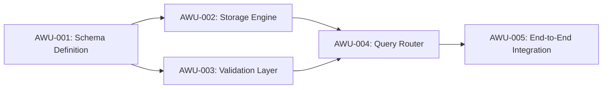

# DAG Specification & Bounded Graph Addition Protocol

## 1. The Directed Acyclic Graph (DAG) Model

A Directed Acyclic Graph (DAG) is a mathematical structure consisting of nodes (vertices) connected by directed links (edges), with no closed loops. In the `dag` skill, every complex engineering project is represented as a DAG:
- **Nodes**: Atomic Work Units (AWUs)—discrete, self-contained packages of work.
- **Edges**: Prerequisite dependencies ($A \to B$ denotes that AWU-A must complete and pass verification before AWU-B may begin).



---

## 2. Properties of an Atomic Work Unit (AWU)

Every node in the DAG must satisfy four core criteria:

1. **Single Responsibility**: The unit achieves exactly one functional objective (e.g., "Implement JWT token validation middleware", not "Implement auth, database, and UI").
2. **Deterministic Inputs and Outputs**: All input files, schemas, and configurations are explicitly listed; all expected output files, functions, and interfaces are predefined.
3. **Independent Verifiability**: The work unit can be tested, falsified, and audited in complete isolation using automated tests, mock contracts, or property checks.
4. **Finite Blast Radius**: A failure in the AWU is trapped within its boundary without corrupting downstream system state.

---

## 3. DAG Manifest Specification (`dag_manifest.json`)

The orchestrator maintains the canonical state of the graph in `.omp_wip/<session>/01_dag/dag_manifest.json`.

```json
{
  "$schema": "http://json-schema.org/draft-07/schema#",
  "session_id": "2026-09-20_01-15-00_auth-refactor",
  "task_moniker": "auth-refactor",
  "graph_version": 1,
  "nodes": [
    {
      "id": "AWU-001",
      "slug": "token-crypto-primitives",
      "title": "Implement Cryptographic Token Primitives",
      "status": "COMPLETED",
      "assigned_maker_persona": "PrincipalSystemsMaker",
      "checker_personas": [
        "CorrectnessContractFalsifier",
        "SecurityInvariantAuditor",
        "SystemicBlastRadiusSentinel"
      ],
      "dependencies": [],
      "inputs": ["src/crypto/constants.ts"],
      "expected_outputs": ["src/crypto/token.ts", "tests/crypto/token_test.ts"],
      "iteration_count": 1,
      "max_iterations": 3
    },
    {
      "id": "AWU-002",
      "slug": "session-store-interface",
      "title": "Define Redis Session Store Adapter",
      "status": "PENDING",
      "assigned_maker_persona": "DistributedStorageSpecialist",
      "checker_personas": [
        "DatabasePerformanceAuditor",
        "EnterpriseSecurityArchitect",
        "SystemicBlastRadiusSentinel"
      ],
      "dependencies": ["AWU-001"],
      "inputs": ["src/crypto/token.ts"],
      "expected_outputs": ["src/store/session.ts", "tests/store/session_test.ts"],
      "iteration_count": 0,
      "max_iterations": 3
    }
  ]
}
```

---

## 4. Execution Scheduling: Topological Sorting

1. **Prerequisite Gating**: An AWU enters `IN_PROGRESS` only when **all** nodes listed in its `dependencies` array have achieved `status: COMPLETED` with signed debriefings.
2. **Parallel Scheduling**: Nodes with no mutual dependencies and satisfied prerequisites can be scheduled concurrently across independent subagents, provided each subagent runs with its own context budget.
3. **Linear State Locking**: No node may modify files claimed by an active predecessor or sibling node.

---

## 5. Bounded Graph Addition (BGA) Protocol

Real-world execution frequently reveals unknown unknowns (e.g., during AWU-002, the maker discovers that an underlying network library lacks an asynchronous reconnection hook). Rather than corrupting the active AWU with out-of-scope work or freezing the pipeline, the system allows **Bounded Graph Addition (BGA)**.

### BGA Guardrails and Constraints:

```text
┌────────────────────────────────────────────────────────────────────────┐
│                   BOUNDED GRAPH ADDITION (BGA) RULES                   │
├────────────────────────────────────────────────────────────────────────┤
│ Rule 1: Node Cardinality Bound  -> Maximum 3 added nodes per session   │
│ Rule 2: Graph Depth Bound       -> Maximum +1 increase in depth        │
│ Rule 3: Strict Acyclicity       -> Acyclic property rigorously verified │
│ Rule 4: Adversarial Audit       -> Independent Checker approval required│
│ Rule 5: Zero Goldplating        -> Must resolve a hard technical block │
└────────────────────────────────────────────────────────────────────────┘
```

### The 4-Step BGA Procedure:
1. **Proposal Formulation**:
   - The active subagent or orchestrator files a `BGA_PROPOSAL` document in `.omp_wip/<session>/01_dag/bga_proposals/`.
   - Documents the exact technical blocker, why the existing AWU cannot absorb it, the proposed atomic node (`AWU-00X-EXT`), and its proposed dependencies.
2. **Acyclicity & Bound Verification**:
   - Run `python3 ~/.omp/agent/skills/dag/scripts/validate_dag.py --manifest-path .omp_wip/<session>/01_dag/dag_manifest.json` (or `~/.omp/agent/skills/dag/scripts/validate_dag.sh --manifest-path ...`) to mathematically prove that inserting the new node does not create a cyclic dependency, enforces the cardinality bound ($\le 3$), and strictly verifies that graph depth increases by at most $+1$.
3. **Adversarial Panel Approval**:
   - The **BGA Architectural Arbiter (Claude Opus 5.5 xhigh)** evaluates the BGA proposal:
     - Is this a genuine blocker or scope creep/goldplating?
     - Is the proposed node truly atomic?
   - If rejected, the Maker must find an in-scope workaround without expanding the graph.
4. **Graph Manifest Mutation & Unit Scaffolding**:
   - Upon approval, the orchestrator updates `dag_manifest.json` (incrementing `graph_version`), scaffolds the unit directory and on-disk contracts with `python3 ~/.omp/agent/skills/dag/scripts/scaffold_dag_unit.py --unit-id "AWU-00X-EXT" ...` (or `~/.omp/agent/skills/dag/scripts/scaffold_dag_unit.sh ...`), and regenerates `dag_graph.md`.

---

## 5.5 Execution-Phase Dynamic Discovery & Assumption Invalidation Human Gate

While BGA addresses *missing tasks*, execution often uncovers empirical facts that directly contradict or invalidate *prior baseline assumptions* (e.g., an assumed database trigger does not exist, an upstream API response structure differs from documentation, or an assumed concurrency model causes deadlocks).

### Non-Negotiable Human Gate Invariant
Under the Zero-Hallucination Axiom, no autonomous agent is permitted to guess a replacement assumption or unilaterally synthesize speculative workarounds.

### The 4-Step Invalidation Protocol:
1. **Immediate Execution Freeze (`status: "BLOCKED"`)**:
   The active AWU is immediately placed into `BLOCKED` status in `dag_manifest.json`. Downstream tasks cannot execute.
2. **Mandatory Human Gate Registration**:
   The orchestrator registers the invalidation:
   ```bash
   fdag invalidate-assumption --unit-id "<AWU-ID>" --assumption "<Prior Assumption>" --evidence "<Observed Failure/Trace>"
   ```
3. **Formal Socratic Dialogue Inquiry**:
   A Socratic dialogue is queued adhering to the single-question discipline:
   - **Plain Human Language**: All technical terms explained inline in parentheses.
   - **Single Question**: Exactly one targeted question regarding how to re-align the architecture or contract.
   - **Evaluated Options**: Exhaustive evaluation of trade-offs, pros, and cons.
   - **Recommendation First**: Optimal path marked `(Recommended)` at Index 0.
4. **Human Decision Sign-off & Unblocking**:
   The human operator selects the resolution path:
   ```bash
   fdag resolve-invalidation --invalidation-id "INVAL-001" --option-id "OPT-1" --summary "<Human Decision Rationale>"
   ```
   This updates `dag_manifest.json` (`human_gate_status: "RESOLVED_BY_HUMAN"`), appends a permanent learning record to `learnings.jsonl`, annotates `briefing.md`, and restores the unit to `IN_PROGRESS`.

*(Note: If any unadjudicated assumption invalidation remains active, both `fdag validate` and `fdag adjudicate` trigger an unappealable Sev-1 Human Gate Veto).*
---

## 6. On-Disk Auditability & State Validation

Before marking any phase or the entire session complete, the orchestrator executes the on-disk auditor:
```bash
python3 ~/.omp/agent/skills/dag/scripts/validate_dag.py --audit-disk
# Or using the shell wrapper:
~/.omp/agent/skills/dag/scripts/validate_dag.sh --audit-disk
```
This validates:
1. Every node in `dag_manifest.json` has a corresponding directory under `units/<AWU-ID>_<slug>/`.
2. Every node has a formal `briefing.md` and an initialized `learnings.jsonl`.
3. Every completed node has a signed `debriefing.md` and a 3-agent `panel_verdicts.md` record with zero unaddressed Sev-1 or Sev-2 violations.
