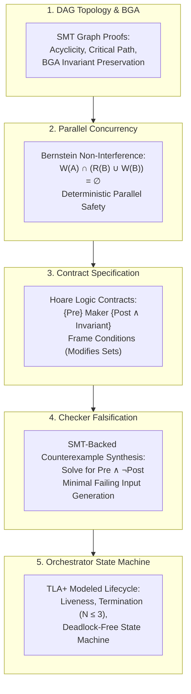

# Formal Methods in Agentic DAG Orchestration: Mathematical Rigor for Autonomous Systems

## 1. Introduction: The Epistemic Crisis of LLM Engineering

Autonomous AI agents generate software through probabilistic token prediction. While modern frontier models demonstrate remarkable semantic fluency, they lack intrinsic models of mathematical ground truth. They are vulnerable to:
1. **Semantic Drift**: Subtle alterations of intended program behavior across iterations.
2. **Hidden Invariant Violations**: Generating code that satisfies immediate syntactic tests while breaching foundational architectural invariants (e.g., transactional isolation, memory safety, thread safety).
3. **Subjective Verification**: Relying on other LLMs to review code using natural language prompts, producing uncalibrated, non-deterministic, and sycophantic judgments.

**Formal methods**—the application of mathematical logic, automata theory, and formal semantics to specification, synthesis, and verification—provide the deterministic foundation required to resolve this crisis.

This document presents a comprehensive analysis of how formal methods can be practically, efficiently, and rigorously integrated into the `dag` skill.

---

## 2. Taxonomy of Formal Methods & The "Formal-Lite" Paradigm

Formal methods exist on a spectrum of mathematical rigor and computational cost:

```text
┌────────────────────────────────────────────────────────────────────────┐
│                      THE FORMAL METHODS SPECTRUM                       │
├───────────────────┬───────────────────┬────────────────────────────────┤
│ Heavyweight       │ Mediumweight      │ Lightweight ("Formal-Lite")    │
├───────────────────┼───────────────────┼────────────────────────────────┤
│ Interactive       │ Model Checking    │ Design by Contract (DbC)       │
│ Theorem Proving   │ (TLA+, Spin)      │ SMT Constraint Solving (Z3)    │
│ (Coq, Isabelle,   │ Symbolic Model    │ Property-Based Fuzzing         │
│  Lean, Agda)      │ Verifiers (Alloy) │ Bernstein Concurrency Algebra  │
│                   │                   │ Typed Predicate Schemas        │
├───────────────────┼───────────────────┼────────────────────────────────┤
│ ❌ Intolerable    │ ⚠️ Selective Use   │ ✅ High Leverage in `dag`       │
│    Cognitive Cost │    (Lifecycle FSM)│    (Contracts, Parallel Safety)│
└───────────────────┴───────────────────┴────────────────────────────────┘
```

### 2.1 Why Heavyweight Methods Fail in Agentic Workflows
Attempting to force an LLM to generate interactive machine-checked proofs in Coq or Lean for arbitrary application software introduces catastrophic overhead:
- **Proof Complexity**: Writing the formal proof often requires $10\times$ to $50\times$ more code than the functional implementation.
- **Model Fragility**: LLMs frequently struggle with the delicate tactic steps required by interactive proof assistants, leading to rapid context window exhaustion and infinite failure loops.

### 2.2 The "Formal-Lite" Sweet Spot
The optimal balance for autonomous engineering is **Lightweight Formal Methods** ("Formal-Lite"):
- **SMT Solvers (Satisfiability Modulo Theories)**: Automated decision procedures (e.g., Z3) that evaluate mathematical logic formulas without human proof guidance.
- **Design by Contract (DbC)**: Explicit, machine-verifiable pre-conditions, post-conditions, and frame conditions (`modifies` clauses).
- **Concurrency Algebra**: Set-theoretic proofs of non-interference (Bernstein's Conditions) to guarantee race-free parallel execution.
- **Property-Based Falsification**: Deterministic automated generation of inputs to stress-test mathematical invariants (QuickCheck / Hypothesis methodology).

---

## 3. High-Leverage Applications of Formal Methods in `dag`

There are five key points in the `dag` architecture where formal methods deliver game-changing reliability:



---

### 3.1 Structural Graph Soundness & Bounded Graph Addition (BGA)

#### The Current Limitation:
The current `dag` skill validates graphs using Kahn's algorithm in `validate_dag.py`. While Kahn's algorithm successfully detects cycles in static graphs, it provides no formal guarantees when the graph is dynamically mutated during execution via Bounded Graph Addition (BGA).

#### The Formal Methods Solution:
A DAG can be modeled as a strict partial order $(V, \prec)$ where $u \prec v$ indicates that $u$ must execute and complete before $v$. 

1. **Acyclicity Invariant**:
   $$\forall u, v \in V, \quad u \prec v \implies \neg (v \prec u)$$
   Transitive closure: $\prec^+ = \bigcup_{i=1}^\infty \prec^i$. The graph is acyclic if and only if:
   $$\forall u \in V, \quad (u, u) \notin \prec^+$$

2. **Graph Depth & Critical Path Invariant**:
   Let $\text{depth}(v)$ be the length of the longest directed path from a root node to $v$:
   $$\text{depth}(v) = \begin{cases} 
   0, & \text{if } \text{InDegree}(v) = 0 \\ 
   1 + \max_{u \in \text{Parents}(v)} \text{depth}(u), & \text{otherwise} 
   \end{cases}$$
   The total DAG depth is $D = \max_{v \in V} \text{depth}(v)$.

3. **Formal Verification of Bounded Graph Addition (BGA)**:
   When an agent proposes adding a set of nodes $V_{add}$ and edges $E_{add}$ mid-flight:
   - **Cardinality Invariant**: $|V_{add}| \le 3$.
   - **Depth Invariant**: $\Delta D = D(G \cup G_{add}) - D(G) \le 1$.
   - **Acyclicity Invariant**: Acyclic$(G \cup G_{add}) = \text{True}$.
   - **Monotonicity of Completed State**: Let $V_{completed} \subseteq V$ be the set of nodes already marked `COMPLETED`. An edge $(u, v) \in E_{add}$ is valid if and only if $v \notin V_{completed}$. A dynamic mutation can never introduce a dependency pointing backward into a node that has already executed and closed its context!

By embedding these invariants into an automated validator, BGA proposals can be mathematically verified in less than 5 milliseconds, rejecting invalid mutations before any subagent is instantiated.

---

### 3.2 Parallel Concurrency & Bernstein's Non-Interference Conditions

#### The Problem:
Modern hardware and subagent architectures permit executing independent work units in parallel. However, if two concurrent subagents modify the same file or read a file while it is being rewritten, the build will corrupt non-deterministically.

Currently, `dag_graph_protocol.md` specifies a manual rule: *"Linear State Locking: No node may modify files claimed by an active predecessor or sibling node."* But `validate_dag.py` provides **zero automated verification** of this rule.

#### The Mathematical Foundation: Bernstein's Conditions (1966)
Let each AWU $u \in V$ declare:
- **Read-Set ($\mathcal{R}_u$)**: The set of input files, schemas, and environment variables read by unit $u$.
- **Write-Set ($\mathcal{W}_u$)**: The set of output files, artifacts, and state paths modified or created by unit $u$.

For any two nodes $u, v \in V$ that are **topologically independent** (i.e., $u \not\prec^+ v$ and $v \not\prec^+ u$), they may be scheduled concurrently in parallel subagents **if and only if** they satisfy Bernstein's Conditions:

$$\begin{aligned}
1. \quad & \mathcal{R}_u \cap \mathcal{W}_v = \emptyset & \text{(No Read-After-Write conflict)} \\
2. \quad & \mathcal{W}_u \cap \mathcal{R}_v = \emptyset & \text{(No Write-After-Read conflict)} \\
3. \quad & \mathcal{W}_u \cap \mathcal{W}_v = \emptyset & \text{(No Write-After-Write conflict)}
\end{aligned}$$

#### Frame Conditions (`modifies` clauses):
In formal specification (e.g., Hoare logic, JML, Dafny), a contract must specify a **Frame Condition**—the exact boundary of state the component is permitted to alter. 

In `dag`, every AWU must declare its frame condition:
$$\text{Frame}(u) = \mathcal{W}_u$$
Any subagent write outside of $\mathcal{W}_u$ (detected via filesystem diff or git status) constitutes an **immediate, un-appealable Sev-1 Frame Violation**.

#### Automated Concurrency Matrix:
By computing the Bernstein intersection matrix for all topologically independent pairs $(u, v)$:
- If $\text{Bernstein}(u, v) = \text{True}$, they are flagged in `dag_manifest.json` as `parallel_safe: true`.
- If $\text{Bernstein}(u, v) = \text{False}$, the orchestrator automatically inserts a synthetic serialization barrier or warning, preventing catastrophic concurrent file clobbering.

---

### 3.3 Formal Contract Specification for Atomic Work Units

#### The Problem:
Natural-language contracts in `briefing.md` are inherently ambiguous. Phrases like *"Ensure the function handles invalid tokens gracefully"* provide no objective boundary between correct behavior, error throwing, or returning `null`.

#### The Hoare Logic Formulation:
An Atomic Work Unit is a state transformer. We can formalize its contract using a Hoare Triple:

$$\{P\} \quad \text{AWU} \quad \{Q \land I\}$$

Where:
- $P(s)$ is the **Pre-condition**: A mathematical predicate over the system state $s$ before execution.
- $Q(s, s')$ is the **Post-condition**: A relation between the initial state $s$ and final state $s'$ guaranteed upon successful completion.
- $I(s')$ is the **System Invariant**: Universal properties (e.g., memory safety, non-null guarantees, ACID properties) that must hold for all states $s'$.

#### Structured Contract Schema:
Instead of freeform markdown, contracts should be specified using typed predicate structures:

```json
{
  "contract": {
    "pre_conditions": [
      {
        "id": "PRE-01",
        "description": "Configuration file exists and contains valid JSON",
        "predicate": "FileExists('config/auth.json') and ValidJson('config/auth.json')"
      },
      {
        "id": "PRE-02",
        "description": "Cryptographic key length must be 256 bits",
        "predicate": "Length(Env.SECRET_KEY) == 32"
      }
    ],
    "post_conditions": [
      {
        "id": "POST-01",
        "description": "Sign function produces non-empty base64 string",
        "predicate": "forall(msg: String, Length(msg) > 0 ==> Length(Sign(msg)) > 0)"
      },
      {
        "id": "POST-02",
        "description": "Verify function is the exact inverse of Sign",
        "predicate": "forall(msg: String, Verify(Sign(msg)) == Valid(msg))"
      }
    ],
    "frame_conditions": {
      "modifies": [
        "src/crypto/token.ts",
        "tests/crypto/token_test.ts"
      ],
      "immutable": [
        "src/config/**",
        "package.json"
      ]
    }
  }
}
```

This transforms acceptance testing from a subjective reading comprehension exercise into an automated assertion suite.

---

### 3.4 SMT-Backed Counterexample Synthesis for Checker Panelists

#### The Problem:
Currently, Panelist 1 (Correctness & Contract Boundary Falsifier) attempts to find bugs by reading code and guessing edge cases. While frontier models are good at spotting common mistakes, they frequently miss subtle mathematical edge cases (e.g., integer overflow, off-by-one under bitwise operations, non-associative floating point operations, pathological regex backtracking).

#### The SMT Solution (Satisfiability Modulo Theories):
An SMT solver (such as Microsoft's Z3 or CVC5) determines whether a first-order logical formula is satisfiable.

In formal falsification, we do not attempt to prove the code correct (which is undecidable in general). Instead, **we attempt to prove the code incorrect by finding a counterexample!**

Given:
- Pre-condition: $P(x)$
- Program semantics: $y = f(x)$
- Guaranteed Post-condition: $Q(x, y)$

The verification condition for correctness is:
$$\forall x, \quad P(x) \implies Q(x, f(x))$$

To falsify this, we ask the SMT solver to find a solution to the negation:
$$\exists x, \quad P(x) \land \neg Q(x, f(x))$$

```text
┌────────────────────────────────────────────────────────────────────────┐
│              SMT-BACKED ADVERSARIAL FALSIFICATION FLOW                 │
├────────────────────────────────────────────────────────────────────────┤
│ 1. Maker synthesizes functional code: f(x)                             │
│ 2. Panelist 1 extracts logic constraints & post-condition Q(x, y)      │
│ 3. SMT Solver executes query: Solve( P(x) ∧ ¬Q(x, f(x)) )             │
│                                                                        │
│ Case A: Solver returns SAT with model {x = 0, y = -1}                  │
│         -> INCONTROVERTIBLE COUNTEREXAMPLE FOUND.                      │
│         -> Automatic Sev-1 Veto. Counterexample injected to learnings. │
│                                                                        │
│ Case B: Solver returns UNSAT (within bounded domain)                   │
│         -> MATHEMATICAL PROOF OF CORRECTNESS (within bound).           │
│         -> Panelist 1 issues unreserved APPROVE.                       │
└────────────────────────────────────────────────────────────────────────┘
```

#### Property-Based Testing as Executable SMT:
When full symbolic execution in Z3 is too complex (e.g., code depends on third-party dynamic libraries), **Property-Based Testing (PBT)** (using libraries like `Hypothesis` in Python or `fast-check` in TypeScript) acts as an empirical SMT solver:
- Instead of testing 3 hardcoded cases (`x=1`, `x="abc"`, `x=""`), the PBT engine generates thousands of pseudorandom and boundary-targeted inputs according to the pre-condition distribution.
- When an input violates a post-condition invariant, the engine automatically **shrinks** the input to the absolute minimal failing counterexample (e.g., reducing a 500-character string to `"\x00"`).

Equipping Panelist 1 with automated PBT generation eliminates subjective arguments between Maker and Checker. The Checker presents a reproducible, minimal reproducing test script.

---

### 3.5 State Machine Verification of the Orchestrator Lifecycle

#### The Problem:
The orchestration lifecycle of `dag` is complex:
- Work units cycle through `PENDING`, `IN_PROGRESS`, `REJECT_VETO`, `REJECT_MAJORITY`, `PASS_WITH_CAVEAT`, and `COMPLETED`.
- Bounded self-learning loops trigger re-briefing up to iteration $N \le 3$.
- Bound breaches trigger `HUMAN_ESCALATION`.
- Dynamic discoveries trigger Bounded Graph Addition (BGA).

If the state machine has an unhandled transition or missing guard, the orchestrator can:
- Enter an infinite loop.
- Prematurely mark a failed unit as completed.
- Create an orphan node during BGA that deadlocks the entire workflow.

#### The TLA+ / Automata Formalization:
We can formally specify the orchestration engine as a Finite State Automaton:

```text
States S = { PENDING, ACTIVE, ADJUDICATING, REBRIEFING, COMPLETED, ESCALATED, HALTED }
Inputs Σ = { start_unit, submit_diff, pass_verdict, reject_veto, bga_trigger, human_resolve }
Transition Function δ: S × Σ → S
```

#### Key Formal Theorems to Prove:
1. **Liveness & Bounded Termination Theorem**:
   Every AWU must reach either `COMPLETED` or `ESCALATED` in finite steps:
   $$\forall u \in V, \quad \Diamond (\text{status}(u) = \text{COMPLETED} \lor \text{status}(u) = \text{ESCALATED})$$
   *Proof sketch*: Since $N \in \{1, 2, 3\}$, every `REJECT` strictly increments $N$. For $N=3$, the transition function $\delta(\text{ADJUDICATING}, \text{reject}) = \text{ESCALATED}$ is terminal. There are no cycles without incrementing $N$.

2. **Monotonic Progress Theorem**:
   The set of completed nodes $V_{comp}$ is strictly monotonically non-decreasing:
   $$\forall t_1 < t_2, \quad V_{comp}(t_1) \subseteq V_{comp}(t_2)$$
   A completed unit is never rolled back to pending without explicit human intervention.

3. **Deadlock Freedom Theorem**:
   The system never enters a state where active nodes are empty, uncompleted nodes exist, and no uncompleted node has satisfied prerequisites:
   $$\text{Uncompleted} \ne \emptyset \land \text{Active} = \emptyset \implies \exists u \in \text{Uncompleted} : \text{Parents}(u) \subseteq V_{comp}$$
   This property is guaranteed by the initial topological acyclicity proof.

---

## 4. Trade-Off Analysis: The "Formal Methods Trap" & Practical Boundaries

While formal methods offer mathematical certainty, uncritical adoption can cripple an engineering system. We must explicitly analyze the trade-offs:

| Formal Method Technique | Computational Cost | Specification Burden | False Positive Rate | Recommended Adoption in `dag` |
| :--- | :--- | :--- | :--- | :--- |
| **Interactive Theorem Proving (Coq/Lean)** | Extremely High ($>10\times$) | Intolerable | Low | ❌ **Reject**: Paralyzes velocity and causes LLM context failure. |
| **Full Software Model Checking (Spin/CBMC)** | High (State explosion on loops) | Moderate | Medium | ⚠️ **Specialized Only**: Reserved for kernel/concurrency primitives. |
| **SMT Constraint Falsification (Z3)** | Low to Moderate ($<2$ seconds) | Low (Typed predicates) | Extremely Low (Mathematical) | ✅ **Adopt for Panelist 1**: Razor-sharp edge-case falsification. |
| **Property-Based Testing (Hypothesis/fast-check)** | Low ($<5$ seconds) | Very Low (Python/TS decorators) | Zero (Direct test execution) | ✅ **Mandatory for Panelist 1 & Maker**: Automated counterexample generation. |
| **Bernstein Concurrency Algebra** | Negligible ($<10$ milliseconds) | Zero (Derived from manifest sets) | Zero | ✅ **Mandatory in `validate_dag.py`**: Proves parallel safety. |
| **Pydantic / JSON-Schema Contracts** | Negligible ($<1$ millisecond) | Low | Zero | ✅ **Mandatory Replacement for Regex**: Complete pipeline robustness. |

---

## 5. Strategic Recommendations for `dag`

To maximize leverage while preserving development velocity, the `dag` skill should implement a **Three-Pillar Formal Foundation**:

1. **Pillar 1: Structural & Concurrency Algebra in `validate_dag.py`**
   - Implement automated Bernstein non-interference verification on `inputs` and `expected_outputs` sets.
   - Enforce BGA depth and cardinality invariants mathematically.
   - Flag parallel-safe units explicitly in the manifest.

2. **Pillar 2: Machine-Readable Typed Contracts & Frame Conditions**
   - Replace Markdown prose pre/post-conditions with typed JSON Schema specifications.
   - Enforce explicit `modifies` clauses (Frame Conditions) and automatically fail any unit that touches files outside its declared write-set.

3. **Pillar 3: SMT & Property-Based Falsification in Adversarial Panels**
   - Provide Panelist 1 with a lightweight SMT solver (Z3) and Property-Based Testing harness.
   - Redefine Sev-1 and Sev-2 defects: A defect is Sev-1 if an SMT solver or PBT test produces a concrete counterexample demonstrating post-condition failure or invariant violation.
   - Eliminate subjective opinions: if the checker cannot produce a reproducible counterexample or formal proof of contract breach, the defect cannot trigger an automated veto!
