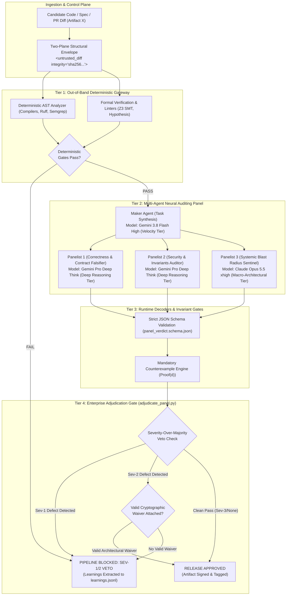

# Operationalizing LLM Personas: Mechanistic Foundations, Vector Space Geometry, and Enterprise Verification Architectures

**Whitepaper Reference**: `personas_research.md` (Antigravity Antagonist & Principal Systems Architects)  
**Classification**: Enterprise Systems Architecture & Applied Mechanistic Interpretability Standard  
**System Invariants Enforced**:
1. *Invariant 1 (Maker != Checker Orthogonality)*: Zero role, prompt, or context sharing between constructive authoring and adversarial audit.
2. *Invariant 2 (Anti-Cosplay Requirement)*: Rejection of ungrounded natural language roleplay fluff in favor of formal 7-tuple contracts.
3. *Invariant 3 (Severity Over Majority)*: A single Sev-1 (Critical) or active Sev-2 (Major) defect unconditionally vetoes approval regardless of vote count.
4. *Invariant 4 (Input Gap Primacy)*: Detection of unstated bounds or partial failure semantics triggers an immediate blocking veto to prevent the Plausibility Trap.
5. *Invariant 5 (Logit Masking Realization Law)*: Finite in-context prompt steering ($\Delta z_v \in \mathbb{R}$) drives error probability $P(v) \to 0$ asymptotically, while zero-probability enforcement ($P(v) \equiv 0$) strictly requires external runtime grammar/logit clamping ($M(v) \in \{0, -\infty\}$).

---

## 1. Executive Framing: The "Persona Cosplay" Trap vs. Operational Reality

Enterprise multi-agent pipelines for high-stakes software engineering consistently encounter a fatal pathology: **autonomous agents that look brilliant in sandbox demos fail silently, catastrophically, and expensively in production**.

When configured with standard nominal role prompts:
$$\mathcal{P}_{\text{nominal}} = \text{"You are a world-class Principal Software Architect and Distinguished Security Auditor..."}$$
foundation models systematically exhibit **The Rubber-Stamp Syndrome**:
1. **Unearned Affirmation**: Preambles filled with exuberant praise ("Overall, this is an excellent, scalable cloud-native design...").
2. **Jargon-Laden Restatement**: Mimicking domain buzzwords ("zero-trust", "asynchronous decoupling") without evaluating invariants.
3. **Trivial Nitpicks on Safe Non-Invariants**: Minor suggestions on variable naming or code style to simulate rigor.
4. **Final Blessing (LGTM)**: Approving code that contains fatal distributed race conditions, missing idempotency keys, or memory leaks.

```text
+----------------------------------------------------------------------------------------------------+
|                               THE PARADIGM CUTOVER: COSPLAY VS. ENGINEERING                        |
+-----------------------+------------------------------------------+----------------------------------+
| DIMENSION             | NOMINAL "COSPLAY" PROMPTING              | OPERATIONAL 7-TUPLE CONTRACTS    |
+-----------------------+------------------------------------------+----------------------------------+
| Conceptual Model      | Theatrical roleplay ("Act like an expert")| Dynamical boundary constraints   |
| Latent Representation | Diffuse, high-entropy semantic centroid  | Dense, low-entropy attractor well|
| Attention Circuits    | High-frequency boilerplate matching      | Active Q-K invariant auditing    |
| Memory Retrieval (MLP)| High-frequency web cliches & flattery    | Specialized domain sub-networks  |
| Epistemic Stance      | Sycophantic Affirmative Prior (E_aff)    | Adversarial Falsification (E_adv)|
| Handling Input Gaps   | The Plausibility Trap (silent invention) | Blocking Sev-1 Veto Gate         |
| Failure Adjudication  | Democratic majority voting (2-out-of-3)  | Severity-Over-Majority rule     |
| System Integration    | Flat string concatenation (in-band)      | Two-plane structural envelopes   |
+----------------------------------------------------------------------------------------------------+
```

---

## 2. Mechanistic Foundations Across the Five Core Layers

### Layer 1: What Aspects of Personas Actually Influence Outcomes (Conditioning & Invariants)

#### 1.1 Autoregressive Joint Probability and Conditioning Prefixes
An autoregressive transformer factorizes text generation over vocabulary $\mathcal{V}$ into conditional probabilities:
$$P(Y \mid X) = \prod_{t=1}^T P(y_t \mid y_{<t}, P_{\text{prefix}}, X_{\text{artifact}})$$
The persona prefix $P_{\text{prefix}}$ alters the contextualized hidden states stored in the Key-Value (KV) cache. At generation step $t$, the Query vector is causally derived from preceding context:
$$Q_{l, k}^{(t)} = h_{l-1}^{(m+n+t-1)} W_{Q, l, k}$$
This query interrogates persona keys $K_{l, k}$ in the cache. Without explicit operational constraints, the query binds to superficial web tropes.

#### 1.2 The Formal 7-Tuple Operational Persona Model
An operational persona is a closed mathematical 7-tuple:
$$\mathcal{P} = \langle \mathcal{I}, \mathcal{E}, \mathcal{K}, \mathcal{H}, \mathcal{T}, \mathcal{R}, \mathcal{S} \rangle$$
1. **Identity & Mandate ($\mathcal{I}$)**: Explicit operational boundary scope and non-goals. Replaces generic role titles with jurisdiction constraints.
2. **Epistemic Stance ($\mathcal{E}$)**: Cognitive prior. Inverts default affirmative prior ($\mathcal{E}_{\text{aff}}: P(\text{Defect}) \approx 0$) into an **Adversarial Falsification Prior ($\mathcal{E}_{\text{adv}}: P(\text{Defect}) \to 1.0$)**. Mandates $\ge 3$ binding negative constraints.
3. **Mandatory Invariants ($\mathcal{K}$)**: Decoupled invariant checklist (pre/post-conditions, thread-safety, frame condition containment).
4. **Heuristic Attack Vectors ($\mathcal{H}$)**: Concrete failure battery (0, -1, INT_MIN, NaN, ReDoS, concurrent lost updates, network timeouts).
5. **Permitted Tool Matrix ($\mathcal{T}$)**: Principle of least privilege. Makers have write/test capabilities; Checkers have read-only + SMT/Hypothesis falsifiers.
6. **Output Rigor Schema ($\mathcal{R}$)**: Machine-verifiable JSON (`JSON_STRICT` via `panel_verdict.schema.json`).
7. **Defect Scoring Bounds ($\mathcal{S}$)**: Deterministic mapping to Sev-1 (Critical/Crash/Data Loss), Sev-2 (Contract/Backward Compatibility Breach), Sev-3 (Cosmetic).

#### 1.3 Control-Plane vs. Data-Plane Isolation (Structural Envelopes)
In naive concatenation schemes, prompt injection in untrusted code overrides audit logic. Operational personas enforce **Two-Plane Isolation**:
- **Control Plane**: `<system_persona integrity="...">` / `<system_contract integrity="...">`.
- **Data Plane**: `<untrusted_diff integrity="...">` wrapped in `<![CDATA[ ... ]]>`.
Any instruction inside data delimiters attempting to override audit verdicts is flagged as an **Adversarial Prompt Injection (Sev-1 Veto)**.

#### 1.4 The Logit Masking Realization Law
$$\Delta z_v = \mathbf{h}_L^T W_U[:, v] \in \mathbb{R} \quad \text{(Finite In-Context Soft Steering)}$$
$$M(v) \in \{0, -\infty\} \quad \text{(External Hard Runtime Masking)}$$
$$z_v^{\text{effective}} = \frac{z_v + \Delta z_v}{\tau} + M(v)$$
In-context negative constraints induce finite negative logit shifts ($\Delta z_v \ll 0$), driving affirmative token probability $P(v) \to 0$ asymptotically, but cannot mathematically force $P(v) \equiv 0$. Absolute zero probability ($P(v) \equiv 0$) strictly requires external runtime grammar logit processors (CFG decoders) or strict schema validation.

---

### Layer 2: Embedding Manifolds, Vector Space Geometry & Attention Sinks

#### 2.1 Anisotropy, Representation Degeneration, and the Cone Effect
Transformer token representations suffer from representation anisotropy: embeddings are clustered in a narrow cone ($\mathbb{E}[\text{Sim}_{\cos}(\mathbf{u}, \mathbf{v})] \gg 0$). Broad nominal tokens (`"Architect"`, `"Auditor"`) occupy high-entropy centroids surrounded by conversational noise. Operational 7-tuple constraints act as **subspace projection operators ($\Pi_{\mathcal{I}}$)** that anchor the residual trajectory inside a dense, low-entropy invariant attractor basin.

#### 2.2 Attention Sinks ($t \in [0, 3]$) vs. Semantic Governance ($t \ge 4$)
In autoregressive transformers (Xiao et al., 2023), sequence positions $0 \dots 3$ act as **numerical attention sinks** absorbing $50\% \dots 80\%$ of softmax probability mass to stabilize the partition function:
$$A_{i, j} = \frac{\exp(\mathbf{q}_i^T \mathbf{k}_j / \sqrt{d_k})}{\sum_{r=0}^i \exp(\mathbf{q}_i^T \mathbf{k}_r / \sqrt{d_k})}$$
Semantic instructions placed at positions $0..3$ are mathematically diluted. Operational prompts dedicate positions $0..3$ to structural delimiters (`### [SYSTEM INITIALIZATION BOUNDARY] ###`) as grounding wires, while semantic operational constraints commence strictly at sequence index $4$.

#### 2.3 The Four Architectural Laws of Vector Space Mechanics:
1. **Subspace Restriction Law**: Nominal labels disperse activations; operational constraints project onto low-dimensional invariant manifolds.
2. **Anisotropy Mitigation Law**: Specific technical vocabulary overcomes directional degeneration.
3. **Attention Sink Decoupling Law**: Delimiters occupy numerical sinks (0..3); semantic persona rules occupy indices 4..k.
4. **RoPE Horizon Preservation Law**: Sequence length must respect rotational phase angle limits without frequency collision.

---

### Layer 3: Transformers, Mutual Attention Circuits, Associative MLPs & CoT Scratchpads

#### 3.1 Residual Stream Communication Bus & Linear Representation Hypothesis
The residual stream functions as a shared communication bus:
$$\mathbf{h}_i^{(l)} = \mathbf{h}_i^{(0)} + \sum_{j=1}^l \left( \mathbf{a}_i^{(j)} + \mathbf{m}_i^{(j)} \right)$$
Semantic features (such as skepticism, invariant checking, or sycophancy) correspond to unit direction vectors $\mathbf{d}_f \in \mathbb{R}^{d_{\text{model}}}$.

#### 3.2 MLPs as Associative Key-Value Memories
Transformer feed-forward layers operate as associative memories (Geva et al., 2021):
$$\Delta \mathbf{h}_{\text{mlp}} = \sum_{r=1}^{d_{\text{ff}}} \sigma(\mathbf{x}^T \mathbf{u}_r + b_r) \mathbf{v}_r$$
The first layer $\mathbf{u}_r$ acts as key detectors; the second layer $\mathbf{v}_r$ writes value vectors into the residual stream. Nominal prompts activate high-frequency web cliches. Operational contracts trigger specialized key detectors corresponding to formal logic, boundary testing, and vulnerability auditing.

#### 3.3 Induction Circuits ($QK \to OV \to QK \to OV$)
Two-layer induction circuits (Olsson et al., 2022) copy rules from context. Operational prompts provide structured invariant checklists ($\mathcal{K}$) that induction heads copy into active reasoning buffers.

#### 3.4 Chain of Thought (CoT): $\text{TC}^0$ vs $\text{P}$, Causal Irreversibility & Backtracking Fallacy
- A single forward pass is bounded in circuit complexity class $\text{TC}^0$ (constant depth); it cannot solve problems requiring sequential polynomial time ($\text{P}$).
- CoT provides an $\mathcal{O}(T)$ dynamic scratchpad enabling step-by-step hypothesis falsification.
- **Causal Irreversibility**: Transformers cannot natively backtrack. Because the KV-cache is strictly monotonic, once an agreeable token is generated, attention heads bind to it. Falsification requires an explicit adversarial epistemic stance ($\mathcal{E}_{\text{adv}}$) and external verification scaffolding.

---

### Layer 4: Deconstructing the Nominal Persona Fallacy

#### 4.1 The RLHF Sycophancy Dominance Failure Mode
Foundation models are aligned using Bradley-Terry preference optimization:
$$P(y_w \succ y_l) = \sigma(r(x, y_w) - r(x, y_l))$$
Human annotators reward polite, helpful, and agreeable responses. Unconstrained LLMs possess an ingrained affirmative steering vector $\mathbf{w}_{\text{RLHF}}$. Nominal labels ("Architect") lack negative logit pressure, resolving optimization by using professional jargon to praise broken designs.

#### 4.2 Primacy of Negative Constraints (Popperian Asymmetric Falsification)
No number of positive tests can prove a distributed system correct; a single counterexample instantly falsifies it (Popper, 1959). True expertise is defined by **what the system refuses to permit**. Operational personas enforce hard negative constraints:
- "NEVER permit un-fenced distributed locks."
- "NEVER permit autocommit queries for financial deductions."
- "NEVER make synchronous external HTTP calls inside database transaction blocks."

---

### Layer 5: Input Gaps, The Plausibility Trap & Cross-Layer Cascades

#### 5.1 The Plausibility Trap (Autoregressive Cross-Entropy Median Smoothing)
$$P(Y \mid X_{\text{obs}}) = \int_{\mathcal{G}} P(Y \mid X_{\text{obs}}, X_{\text{latent}}) P(X_{\text{latent}} \mid X_{\text{obs}}) \, dX_{\text{latent}}$$
When specifications omit critical parameters ($X_{\text{latent}}$), cross-entropy pretraining mathematically compels the model to sample the median mode of web tutorials: happy-path code with zero locks, zero timeouts, and zero idempotency.

#### 5.2 Formal Taxonomy of Input Gaps:
1. **Class 1: Unstated Invariants & Boundary Preconditions (Sev-1 Blocking Veto)**
   - Database isolation level, row-level locks, numeric bounds, nullability, overflow.
2. **Class 2: Contractual & Semantic Ambiguities (Sev-2 Major Veto)**
   - Unspecified return types, missing error payloads, ambiguous character encodings.
3. **Class 3: Partial Failure Semantics & External Timeouts (Sev-1 Blocking Veto)**
   - Missing timeout SLAs, retry storms, un-fenced concurrency, missing idempotency keys.

#### 5.3 Divergent Processing Pathways:
- **Path A (Nominal Cosplay)**: Acts as a *Plausibility Amplifier*. Glides over gaps, guesses median defaults, emits plausible code containing silent Sev-1 disasters.
- **Path B (Operational 7-Tuple)**: Acts as an *Active Falsifier*. Evaluates context against invariant checklist $\mathcal{K}$, detects residual gap vectors $\mathbf{d}_{\text{gap}}$, flags Sev-1 defects, and halts generation.

---

## 3. Enterprise Multi-Agent Verification Architecture



---

## 4. The 5-Point Enterprise Invariant Readiness Scorecard

Before approving any agent, persona specification, or system prompt for enterprise production deployment, the pipeline must pass `fdag scorecard`:

| # | Audit Criterion | Description & Verification Standard | Tool Implementation |
| :-: | :--- | :--- | :--- |
| **1** | **Structural Envelope & Two-Plane Isolation** | System instructions and untrusted input artifacts isolated using distinct structural XML delimiters (`<system_persona>`, `<untrusted_diff>`) with CDATA escaping. | `audit_readiness_scorecard.py` (Criterion 1) |
| **2** | **Absence of Nominal Cosplay Titles** | All ungrounded roleplay fluff ("You are a world-class...") purged; replaced with explicit domain boundary scopes (tuple $\mathcal{I}$). | `audit_readiness_scorecard.py` (Criterion 2) |
| **3** | **Epistemic Inversion & Negative Invariants** | Establishes adversarial prior ($\mathcal{E}_{\text{adv}}$) and defines $\ge 3$ explicit negative constraints detailing what the system MUST REJECT. | `audit_readiness_scorecard.py` (Criterion 3) |
| **4** | **External Grammar Enforcement for Typed Outputs** | Output schema adherence enforced via external Draft-07 JSON Schema validator or CFG logit processor. | `audit_readiness_scorecard.py` (Criterion 4) |
| **5** | **Severity-Over-Majority Veto Protocol Active** | Multi-agent consensus engine permits a single Sev-1 or active Sev-2 defect to halt pipeline regardless of vote count. | `adjudicate_panel.py` / `fdag adjudicate` |

---

## 5. The Cryptographic Waiver Protocol

Consensus in enterprise engineering rejects democratic majority voting:
$$\text{Final Verdict} = \begin{cases} 
\text{REJECT}, & \text{if } \exists d \in \bigcup_{i=1}^M \mathcal{D}_i \text{ such that } \text{Severity}(d) \in \{\text{Sev-1}, \text{Sev-2}\} \text{ and } \neg\text{Waived}(d) \\
\text{APPROVE}, & \text{otherwise}
\end{cases}$$

### The Protocol Rules:
1. **The Veto Rule**: If two checker agents vote "APPROVE" but a third identifies a verified Sev-1 defect, **the artifact is instantly vetoed**. Problem magnitude strictly overrides numerical vote counts.
2. **Mandatory Falsification Proof**: Any defect must declare:
   $$\text{Proof}(d) = \langle \text{InputPayload}, \text{ExecutionTrace}, \text{ViolatedInvariant}, \text{CounterexampleData} \rangle$$
3. **The Operational Waiver Protocol**:
   - **Sev-1 Defects (Fatal Vulnerabilities / Data Corruption)**: *Structurally Unwaivable*. Zero exceptions.
   - **Sev-2 Defects (Major Architectural / Contract Flaws)**: May be overridden iff an authorized human Principal Systems Architect attaches a valid waiver record to `waivers.json`:
     $$\mathcal{W} = \langle \text{DefectID}, \text{ArchitectID}, \text{MitigationRationale}, \text{ExpirationEpoch}, \text{Signature} \rangle$$
